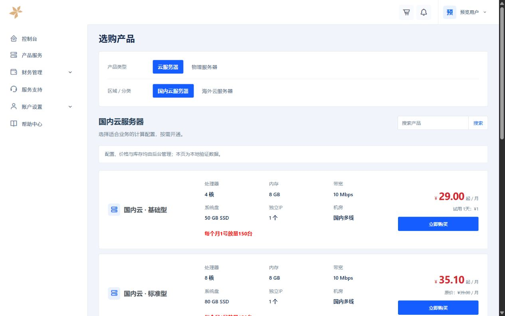

# RtakiCartLedger

**锐泷云购物车 · 横向比较**

适用于智简魔方的购物车主题。采用蓝白配色与横向商品布局，将产品名称、配置规格、价格和购买入口放在同一行，方便用户浏览和比较不同方案。

## 界面预览

> 截图使用本地演示数据，商品名称、配置、库存及价格仅用于展示布局。顶部菜单与左侧账户导航由搭配的用户中心主题提供，实际外观会随所选主题变化。

## 主要功能

- **横向商品展示**：产品名称、规格与价格分区排列，便于逐项比较。
- **后台商品配置**：读取系统商品分组、分类、名称、描述、库存及价格。
- **商品搜索与分页**：保留商品关键词搜索及系统分页入口。
- **购买参数配置**：沿用原生配置选项、计费周期、自定义字段和价格摘要接口。
- **价格与库存状态**：根据后台数据展示优惠价格、试用信息及售罄状态。
- **操作系统图标**：沿用系统及对应模块已有的图标映射与资源。
- **选购流程页面**：包含商品列表、产品配置、订单摘要、购物车和订单完成页面。
- **响应式布局**：适配电脑与手机屏幕。

## 安装使用

1. 将主题目录上传至网站的 `public/themes/cart/RtakiCartLedger/`。
2. 在后台的购物车／订单主题设置中选择 **锐泷云购物车 · 横向比较**。
3. 清理系统模板缓存；如果使用 CDN 或 ESA，同时清理主题静态资源缓存。
4. 打开已有商品，检查配置选项、计费周期、库存状态、价格摘要与购物车流程。

请保留系统自带的 `default` 主题，供公共资源与默认模板回退使用。

购物车的顶部菜单、左侧账户导航和页尾由当前用户中心主题提供，不在本购物车主题内单独配置。

## 兼容说明

本主题基于智简魔方原生模板进行界面定制与适配，保留所参考源码中的普通产品及 v10 通用、魔方云、DCIM 配置入口。具体兼容情况取决于系统版本、模块和插件组合，请部署后按实际业务验证。

商品配置项及操作系统图标由系统和对应模块提供；图标展示取决于模块原有的名称映射与资源。

主题使用系统现有的数据与业务接口，不提供独立后端服务。

## 技术组成

HTML、CSS、JavaScript，以及 ThinkPHP 模板语法（`.tpl`）。

## 开发与联系

**由锐泷云开发 · 主题定制与适配**

- 官网：[锐泷云](https://www.rtaki.com/)
- QQ：1614074517
- 邮箱：[support@rtaki.com](mailto:support@rtaki.com)

## 许可证

锐泷云原创贡献采用 [Apache License 2.0](LICENSE)。智简魔方原始模板代码、第三方组件与素材仍遵循各自的版权声明和许可条款，详见 [NOTICE](NOTICE)。
